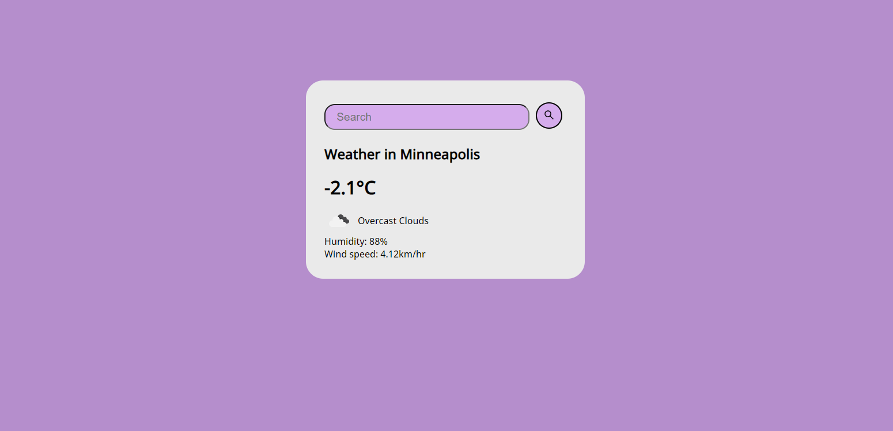

 # Weather App
This is a simple weather app that displays the current weather for a specific city. The user can search for a city by typing its name in the search bar and pressing the search button or by pressing the enter key.

# Technologies Used
JavaScript
HTML
CSS
OpenWeatherMap API
# Getting Started
Clone or download the repository.
Open the index.html file in your browser.
The app should display the weather for Minneapolis by default. To search for the weather of another city, type the city's name in the search bar and press the search button or press the enter key.
# Customization
You can change the default city shown on page load by modifying the fetchWeather("Minneapolis") method call in script.js
You can change the API key by modifying the apiKey property in the weather object in script.js
# Note
The OpenWeatherMap API requires an API key to be used. In this project, the key is hardcoded in the script.js file. If you plan on using this code for a production application, it is recommended to use a separate configuration file to store the API key.
The app uses the free version of the OpenWeatherMap API, which is limited to 60 requests per minute.
The app uses the OpenWeatherMap API, which provides weather data in metric units (Celsius and kilometers per hour).
# License
This project is licensed under the MIT License - see the LICENSE.md file for details

# Acknowledgements
OpenWeatherMap for providing weather data through their API.
Google Fonts for providing the font used in this project.
